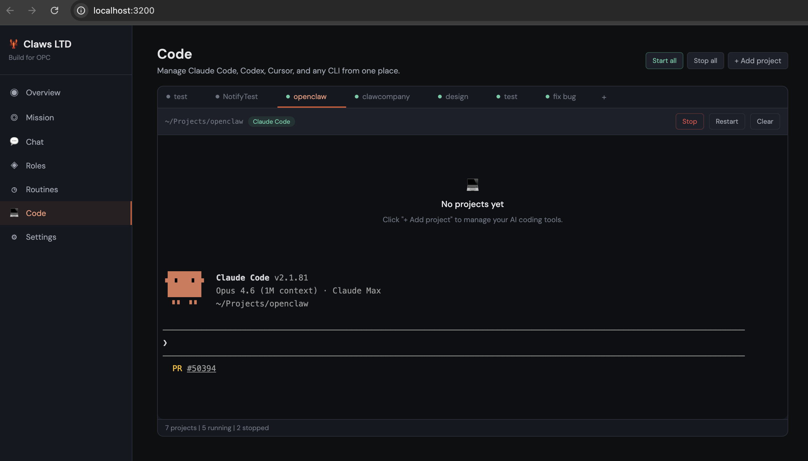
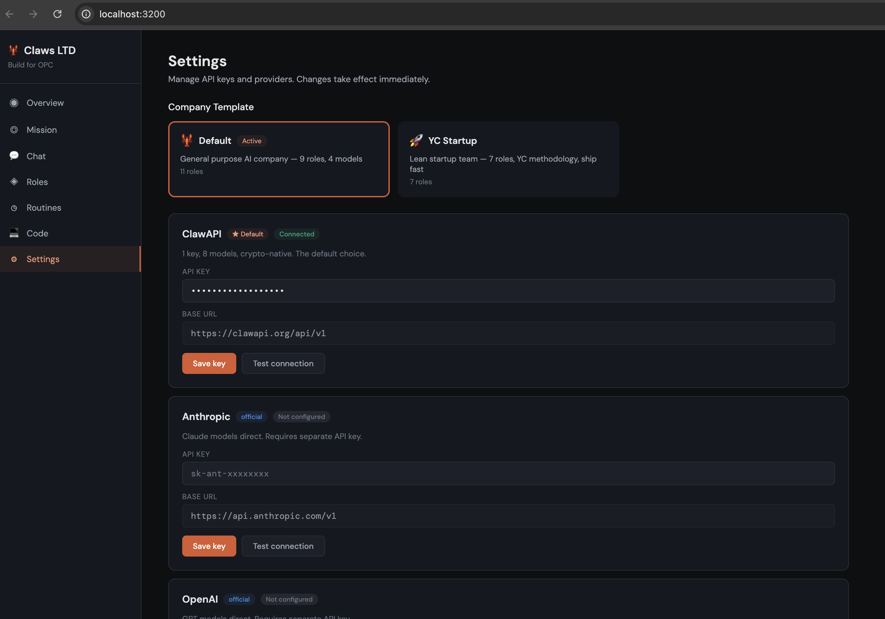

# ClawCompany

> **Build for OPC (One Person Company). Every human being is a chairman.**
>
> Multiple roles, multiple agents, multiple suppliers.
> Your Claws company, one key to run them all.

ClawCompany is the infrastructure for OPC — One Person Companies powered by AI. You are the Chairman. Your AI team (CEO, CTO, CFO, CMO, Engineers, Researchers, Analysts) executes autonomously. You set the goal — they figure out the rest.

**[Website](https://clawcompany.org)** · **[Docs](doc/)** · **[Example Mission](doc/EXAMPLE-MISSION.md)** · **[ClawAPI](https://clawapi.org)**

---

## The OPC model

You don't need to hire anyone. You don't need to manage anyone. You give your company a mission, and it runs.

```
You (Chairman) → "Write a competitive analysis comparing OpenAI vs Anthropic"
    ↓
CEO (Opus) decomposes into work streams ($0.027):
    → Worker collects data (4s, $0.001)
    → Researcher does deep analysis (47s, $0.026)
    → CMO does market positioning (19s, $0.009)
    → Secretary formats final report (6s, $0.001)
    ↓
You: read the report, approve or revise. Done.
```

**Total: 3 minutes, $0.12.** Your AI company just delivered a professional report.

If you ran the same mission using only Opus? **$3.50.** ClawCompany's multi-model architecture is **30x cheaper**.

→ [See the full example mission with cost breakdown](doc/EXAMPLE-MISSION.md)

---

## Quick start — 3 steps, 30 seconds

```bash
npx clawcompany
```

That's it. The wizard guides you through everything:

```
  🦞 ClawCompany v0.22.0
  Build for OPC. Every human being is a chairman.

  Step 1/2: Name your company
  ? Company name: Claws LTD.CO.

  Step 2/2: Choose a template
  ? Template: Default (CEO + CTO + CFO + CMO + Researcher + Analyst + ...)

  ℹ  Set your API key in Dashboard → Settings
     Supports: ClawAPI, Anthropic, OpenAI, Google, Ollama

  ✓ Company "Claws LTD.CO." created
  ✓ 9 agents hired:

     CEO         → claude-opus-4-6 ($5/$25)
     CTO         → gpt-5.4 ($2.5/$15)
     CFO         → gpt-5-mini ($0.25/$2)
     CMO         → claude-sonnet-4-6 ($3/$15)
     Researcher  → claude-sonnet-4-6 ($3/$15)
     Analyst     → gpt-5-mini ($0.25/$2)
     Engineer    → gpt-5.4 ($2.5/$15)
     Secretary   → gemini-flash-lite ($0.25/$1.5)
     Worker      → gemini-flash-lite ($0.25/$1.5)

  "Claws LTD.CO." is ready! You are the Chairman.
```

Now give it a mission:

```bash
clawcompany mission "Write a competitive analysis comparing OpenAI vs Anthropic"
```

No config files. No JSON to edit. No Docker. No proxy. No server to start. Just answer 3 questions.

> **Requirements:** Node.js 20+. Supports ClawAPI, Anthropic, OpenAI, Google, or Ollama. Set your API key in Dashboard → Settings.

---

## Your AI team

One ClawAPI key activates your entire company — 9 roles across 4 models:

| Role | Model | Cost (in/out per 1M) | What they do |
|------|-------|---------------------|--------------|
| **CEO** | `claude-opus-4-6` | $5 / $25 | Decomposes missions, coordinates departments, quality gate |
| **CTO** | `gpt-5.4` | $2.50 / $15 | Technical architecture, code review, system design |
| **CFO** | `gpt-5-mini` | $0.25 / $2 | Financial analysis, budgets, projections (reasoning model) |
| **CMO** | `claude-sonnet-4-6` | $3 / $15 | Marketing strategy, content creation, brand voice |
| **Researcher** | `claude-sonnet-4-6` | $3 / $15 | Deep research, competitive analysis |
| **Analyst** | `gpt-5-mini` | $0.25 / $2 | Data analysis, pattern detection (reasoning model) |
| **Engineer** | `gpt-5.4` | $2.50 / $15 | Code implementation, debugging, testing |
| **Secretary** | `gemini-flash-lite` | $0.25 / $1.50 | Briefings, summaries, formatting |
| **Worker** | `gemini-flash-lite` | $0.25 / $1.50 | Data collection, routine tasks |

**Every role is fully customizable.** Rename, swap models, change providers, add your own roles.

---

## Why multi-model? The right model for the right job

Professional work deserves professional models. Routine work deserves fast, cheap models. ClawCompany assigns automatically — faster execution, better results, 27x lower cost.

| Step | Role | Model | Cost | If all Opus |
|------|------|-------|------|-------------|
| Decompose mission | CEO | opus | $0.027 | $0.027 |
| Data collection | Worker | flash-lite | $0.001 | ~$0.40 |
| Deep analysis | Researcher | sonnet | $0.026 | ~$0.45 |
| Market positioning | CMO | sonnet | $0.009 | ~$0.45 |
| Report formatting | Secretary | flash-lite | $0.001 | ~$0.40 |
| **Total** | | | **$0.12** | **$3.50** |

**96% cheaper. 27x less cost.** Routine work goes to flash-lite at $0.001 per call instead of Opus at $0.40+. The quality is identical because these tasks don't need deep reasoning.

At scale:

| Missions/day | ClawCompany | All-Opus | Monthly savings |
|---|---|---|---|
| 10 | $0.64/day | $17.30/day | **$499/month** |
| 100 | $6.40/day | $173/day | **$4,998/month** |
| 1,000 | $64/day | $1,730/day | **$49,980/month** |

---

## How it works

```
You (Chairman / Board of Directors)
         │
         │ gives mission
         ▼
   ┌─────────────┐
   │     CEO     │  ← Opus: decomposes, coordinates, delivers
   └──────┬──────┘
          │ delegates to department heads
    ┌─────┴──────────────────────────┐
    ▼          ▼         ▼           ▼
┌──────┐  ┌──────┐  ┌──────┐  ┌────────────┐
│ CTO  │  │ CFO  │  │ CMO  │  │ Researcher │
│(5.4) │  │(mini)│  │(Son.)│  │ (Sonnet)   │
└──┬───┘  └──┬───┘  └──────┘  └────────────┘
   ▼         ▼
┌──────┐  ┌───────┐
│ Eng. │  │Analyst│
│(5.4) │  │(mini) │
└──────┘  └───────┘
         ↓ results flow up
   ┌─────────────┐
   │     CEO     │  ← Reviews, integrates, delivers to you
   └──────┬──────┘
          ▼
      You: "Approved" ✓
```

---

## Open model supply layer — 5 built-in providers

ClawCompany is **not** locked to ClawAPI. Five providers are built in, and you can add more:

| # | Provider | What you get |
|---|----------|-------------|
| 1 | **ClawAPI** ★ | 1 key, 8 models, crypto-native. The default. |
| 2 | **Anthropic** | Claude models direct |
| 3 | **OpenAI** | GPT models direct |
| 4 | **Google Gemini** | Gemini models direct |
| 5 | **Ollama** (local) | Run models locally, free |

★ = default supplier, always first

Need another provider? Add it yourself, no approval needed:

```bash
clawcompany provider add --name DeepSeek \
  --url https://api.deepseek.com/v1 --key sk-deep-xxxxx

# Swap any role to any provider
clawcompany role set cto --model deepseek-coder --provider deepseek
```

---

## 💻 Code Manager — ∞ terminals. One Dashboard.

Run Claude Code, Codex, Cursor, and any CLI tool from browser tabs. Full PTY terminal with ANSI colors and interactive input.

- 7 projects. 5 running. 2 stopped. One glance.
- Start all → green dots. Stop all → done.
- Process completes → phone buzzes (Telegram/Discord).
- Real terminal. Not a text viewer.



---

## 🚀 Company Templates — Switch your org chart in one click

Pre-built role configurations for different business types. Switch instantly, keep your custom roles.

- 🦞 **Default** — 9 roles, 4 AI models, general purpose
- 🚀 **YC Startup** — 7 roles, YC methodology, ship fast
- More coming: Media Studio, Trading Desk, E-Commerce



---

## ClawMarket — download a company, one click, it runs

Browse templates, skills, and tools. Install and run instantly.
```bash
clawcompany market list          # Browse all
clawcompany market search "crypto"  # Search
clawcompany market install trading-desk  # Install + apply
```

| Category | Examples | Status |
|----------|---------|--------|
| **Templates** | Trading Desk, Content Agency, Dev Shop, Legal Firm, E-commerce, Consulting, Solo Founder | 8 available |
| **Skills** | Web Scraper, PDF Generator, Crypto Price Feed, Email Sender, GitHub Operations | 5 available |
| **Tools** | Code execution, browser automation | Coming soon |
| **Services** | Slack, HubSpot, Stripe integrations | Coming soon |

One click = working company. No configuration needed.

---

## Agent tools — agents that do things, not just say things

6 built-in tools. Your agents can search the web, read pages, call APIs, write files, and execute code — autonomously.

| Tool | What it does |
|------|-------------|
| **Web Search** | Search the web for real-time info (DuckDuckGo, no API key needed) |
| **Web Fetch** | Read any web page, strip HTML, return clean text |
| **HTTP Requests** | Call any API — GET, POST, PUT, DELETE |
| **Filesystem** | Read, write, list, delete files |
| **Shell** | Execute shell commands (30s timeout) |
| **Code Interpreter** | Run JavaScript or Python code |
| **Browser Use** | Navigate pages, click, type, screenshot, run JS |

Agents use a **think → act → observe** loop: reason about the task, use tools, observe results, repeat until done. Verified: Researcher made 16 tool calls in one mission to gather real-time data.

---

## Chat with your company from anywhere

| Channel | Status | How |
|---------|--------|-----|
| **WebChat** | ✅ Live | `http://localhost:3200/chat.html` |
| **Telegram** | ✅ Live | Add `TELEGRAM_BOT_TOKEN` to `.env` |
| **Discord** | ✅ Live | Coming next |
| **Slack** | 🔜 Soon | Planned |
| **Feishu** | 🔜 Soon | Planned |

Two modes in WebChat:
- **Mission mode** — CEO decomposes, team executes, real-time SSE progress
- **Chat mode** — direct conversation with any role (CEO, CTO, CFO...)

Channel architecture: one `ChannelAdapter` interface for all platforms. Adding a new chat app = ~40 lines of code.

---

## Real-time price feed — zero AI cost
```
/price bitcoin     → $73,727.00 USD (CoinGecko)
/price TSLA        → $395.56 USD (Yahoo Finance)
/price 茅台        → ¥1,485.00 CNY (Yahoo Finance)
/price NVDA        → $183.22 USD (Yahoo Finance)
```

Crypto via CoinGecko, stocks via Yahoo Finance. Auto-detects asset type. Supports Chinese names (特斯拉, 茅台, 腾讯, etc.). Free, instant, 100% accurate — no AI model involved.

Missions that mention assets are auto-enriched with real-time data before reaching the CEO, eliminating price hallucination.

---

## Company memory — gets smarter every mission

Your company auto-learns your preferences, domain, and patterns. Zero configuration.
```
🧠 Company memory loaded

chairman.language: "zh"              // auto-detected
chairman.domains: ["crypto", "finance"]  // learned from missions
chairman.commonMissions: ["analysis", "research"]
company.missionCount: 12
company.recentMissions: ["BTC分析", "ETH对比", ...]
```

**~300 tokens** injected per mission. OpenClaw's SOUL.md loads 4,000-10,000 tokens every session. Same memory quality, **1/17 the cost**.

---

## Why ClawCompany?

| | Single agent (OpenClaw) | Orchestrator (Paperclip) | **ClawCompany** |
|---|---|---|---|
| For whom | Developers | Technical users | **Everyone** |
| Agent source | One agent | External agents | **Built-in team** |
| Model strategy | One model | Agent brings own | **Right model per role** |
| Setup | npm install + config JSON | Docker + Postgres | **npx + 1 key** |
| Human role | Every step | Configure + monitor | **Set goal only** |
| Cost per mission | $0.40-$0.50 (single Opus) | Varies | **$0.06 (multi-model)** |

---

## Development

```bash
git clone https://github.com/Claw-Company/clawcompany.git
cd clawcompany
pnpm install
pnpm dev
```

API runs at `http://localhost:3200`.

---

## License

MIT © 2026 ClawCompany

---

<p align="center">
  <strong>Build for OPC. Every human being is a chairman.</strong><br>
  <em>Your Claws company, one key to run them all.</em>
</p>
